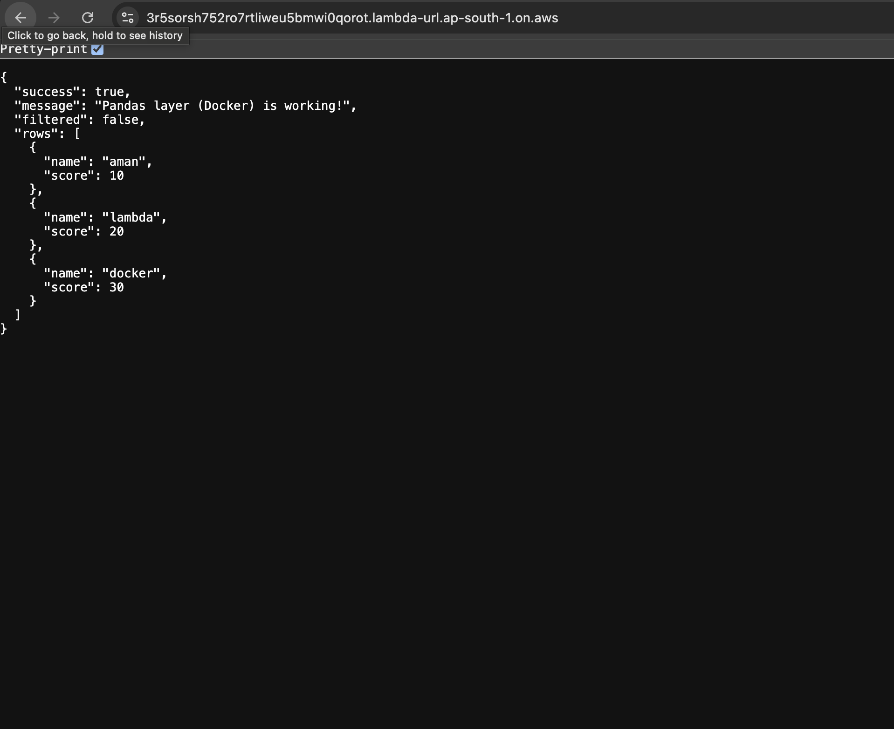
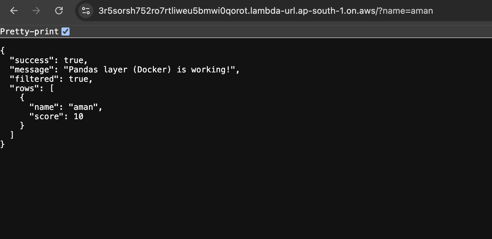
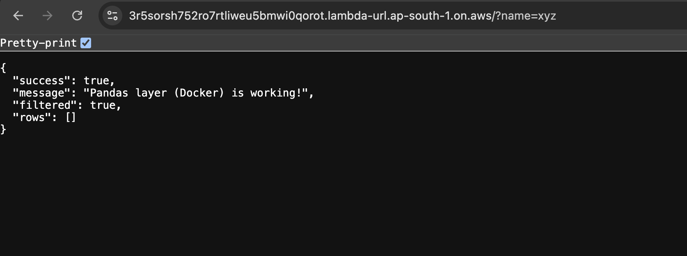

# AWS Lambda + Pandas Layer (Docker Method) + Query Filter API

Live Demo URL-https://3r5sorsh752ro7rtliweu5bmwi0qorot.lambda-url.ap-south-1.on.aws/

## What We Are Building

We are running Pandas inside AWS Lambda.

Here is the challenge: Pandas is tricky on AWS. If you just copy it from your Windows computer to AWS, it will crash because AWS runs on Linux. To fix this, we use Docker to create a "fake" Linux environment on your computer, build Pandas there so it works correctly, and then upload it to AWS as a "Layer."

By the end of this guide, you will have a working API that can filter data based on your inputs.

## Getting Your Windows Machine Ready

Before we start, there are a few tools you'll need. If you already set these up, you can jump straight to the next section.

1. Set up Docker Desktop You need this to build the Linux-compatible version of Pandas. Download the Docker Desktop for Windows installer and run it. Once installed, open the app and wait until you see the green "Engine Running" light.

2. Install the AWS CLI This tool lets your computer talk to AWS. Download the Windows MSI installer, run it, and click through the setup.

3. Connect AWS to Your Computer Go to the AWS Console, click your profile name, and select Security Credentials. Create a new Access Key.

Copy the Access Key ID and Secret Access Key. Then, open PowerShell on your computer and type:

aws configure

Paste your keys when prompted. For the region, type ap-south-1.

Building the Project

We need to create a special "Layer" file that contains Pandas.

First, create a clean folder on your Desktop named lambda-pandas-docker. Open PowerShell and navigate to it:

cd Desktop\lambda-pandas-docker

Step 1: Define What We Need We need to tell Docker exactly which libraries to install. Run these commands in PowerShell to create a list:

echo "pandas==2.3.3" > requirements.txt
echo "numpy==2.2.6" >> requirements.txt

Step 2: Start the Builder Now, we fire up a temporary Linux machine inside your computer. Run this exact command:

docker run --platform linux/amd64 -it --entrypoint /bin/bash -v ${PWD}:/var/task public.ecr.aws/lambda/python:3.10

You are now "inside" the Linux machine! Your command prompt will change to look something like bash-4.2#.

Step 3: Build and Zip Inside that new prompt, run these commands to install Pandas and zip it up:

pip install -r requirements.txt -t python
zip -r pandas-layer-docker.zip python
exit

You are now back in Windows, and you have a new file named pandas-layer-docker.zip in your folder. This is your "Layer".

## Uploading to AWS

Because this zip file is large (~60MB), we upload it to storage (S3) first, then attach it to Lambda.

Step 1: Upload to Storage

Go to the AWS Console and search for S3.

Open any bucket (or create a new one) and click Upload.

Drag and drop your pandas-layer-docker.zip file there and upload it.

Once finished, click the file name and copy the S3 URI (it looks like s3://your-bucket-name/pandas-layer-docker.zip).

Step 2: Create the Layer

Search for Lambda in the console.

Click Layers in the left menu, then Create layer.

Name it pandas-layer-docker.

Select Upload a file from Amazon S3 and paste the URI you copied.

For Compatible Runtimes, select Python 3.10.

Click Create.

## Creating the Lambda Function

Now let's connect everything.

Go to the Lambda dashboard and click Create Function. Name it pandas-api-docker. Choose Python 3.10 as the Runtime and x86_64 as the Architecture. Click Create function.

Attach the Pandas Layer:

In your new function, scroll down to the Layers section.

Click Add a layer.

Select Custom layers, choose pandas-layer-docker, and pick Version 1.

Click Add.

## Adding the Code
Now that Pandas is attached, let's write the logic. Scroll down to the Code Source editor, delete everything, and paste this:

import json
import pandas as pd

def lambda_handler(event, context):
    try:
        df = pd.DataFrame({
            "name": ["aman", "lambda", "docker"],
            "score": [10, 20, 30]
        })

        params = event.get("queryStringParameters") or {}
        name_query = params.get("name")

        if name_query:
            df = df[df["name"].str.lower() == name_query.lower()]

        rows = df.to_dict(orient="records")

        return {
            "statusCode": 200,
            "headers": {"Content-Type": "application/json"},
            "body": json.dumps({
                "success": True,
                "message": "Pandas layer (Docker) is working!",
                "filtered": bool(name_query),
                "rows": rows
            })
        }

    except Exception as e:
        return {
            "statusCode": 500,
            "headers": {"Content-Type": "application/json"},
            "body": json.dumps({
                "success": False,
                "error": str(e)
            })
        }

Click Deploy to save it.

## The Final Step: Making it Public

To share this with the world, we need a public link.

In your function, go to the Configuration tab and select Function URL from the left menu. Click Create function URL, set the Auth type to NONE (public), and save it.

You now have a live URL

## Output Examples

### Below are three output screenshots

A) Output without query param 

https://3r5sorsh752ro7rtliweu5bmwi0qorot.lambda-url.ap-south-1.on.aws/

B) Output with query param (?name=aman)
https://3r5sorsh752ro7rtliweu5bmwi0qorot.lambda-url.ap-south-1.on.aws/?name=aman

C) Output with unmatched query param (?name=xyz) (out13)
https://3r5sorsh752ro7rtliweu5bmwi0qorot.lambda-url.ap-south-1.on.aws/?name=xyz

